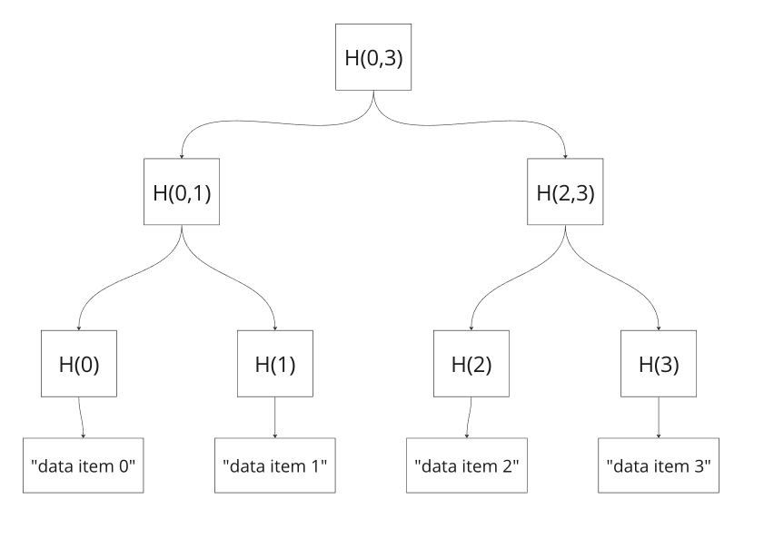

[](https://classroom.github.com/a/VHECRno8)
# Assignment 1: Simple Rust Programs

This assignment is fairly simple and doesn't contain a lot of theory about blockchain technologies. 
The main goal for the exercises is to get students acquainted to rust.

There are total of 4 exercises in this assignment(not necessarily sorted by difficulty),
each of the exercises contains it's own test suit, which is a module located in `src/lib.rs`\
To run all the tests type:
```shell
cargo test
```
To run test suite for specific exercise run:
```shell
cargo test -- --test <test_mod_name>
```
example: 
```shell
cargo test -- --test bob_tests
```
To run a specific test type:
```shell
cargo test -- --test <test_function_name>
```
example:
```shell
cargo test -- --test test_shouting_with_special_characters
```


### Exercise 1: Bob

Bob is a [lackadaisical](https://www.collinsdictionary.com/dictionary/english/lackadaisical) teenager. 
He likes to think that he's very cool. And he definitely doesn't get excited about things. That wouldn't be cool.

When people talk to him, his responses are pretty limited.

#### Instructions
Your task is to determine what Bob will reply to someone when they say something to him or ask him a question.
Bob only ever answers one of five things:

* `"Sure."` This is his response if you ask him a question, such as "How are you?" The convention used for questions is that it ends with a question mark.
* `"Whoa, chill out!"` This is his answer if you **YELL AT HIM**. The convention used for yelling is **ALL CAPITAL LETTERS**.
* `"Calm down, I know what I'm doing!"` This is what he says if you yell a question at him.
* `"Fine. Be that way!"` This is how he responds to silence. The convention used for silence is nothing, or various combinations of whitespace characters.
* `"Whatever."` This is what he answers to anything else.

starting code is located in `src/bob.rs` file. to be honest this is a fairly simple exercise.
you can use any external libraries if you deem it sufficient.\
using a `match` statement or any other [idiomatic approach](https://stackoverflow.com/questions/84102/what-is-idiomatic-code) in this exercise will give you a small bonus ;)

#### additional resources
[.trim() method](https://www.educative.io/answers/what-is-the-stringtrim-method-in-rust)


### Exercise 2: Circular buffer
A circular buffer, cyclic buffer or ring buffer is a data structure that uses a single, fixed-size buffer as if it were connected end-to-end.

A circular buffer first starts empty and of some predefined length. For example, this is a 7-element buffer:

```
[ ][ ][ ][ ][ ][ ][ ]
```

Assume that a 1 is written into the middle of the buffer (exact starting location does not matter in a circular buffer):

```
[ ][ ][ ][1][ ][ ][ ]
```

Then assume that two more elements are added — 2 & 3 — which get appended after the 1:

```
[ ][ ][ ][1][2][3][ ]
```
If two elements are then removed from the buffer, the oldest values inside the buffer are removed. The two elements removed, in this case, are 1 & 2, leaving the buffer with just a 3:

```
[ ][ ][ ][ ][ ][3][ ]
```
If the buffer has 7 elements then it is completely full:

```
[5][6][7][8][9][3][4]
```
When the buffer is full an error will be raised, alerting the client that further writes are blocked until a slot becomes free.

When the buffer is full, the client can opt to overwrite the oldest data with a forced write. 
In this case, two more elements — A & B — are added, and they overwrite the 3 & 4:

```
[5][6][7][8][9][A][B]
```

Because there is space available, if the client again uses overwrite to store C & D then the space where 5 & 6 were stored previously will be used not the location of 7 & 8. 7 is still the oldest element and the buffer is once again full.

```
[C][D][7][8][9][A][B]
```

The above explanation is taken from [Wikipedia](https://en.wikipedia.org/wiki/Circular_buffer).

The starting code for the exercise is located in the `src/circular.rs`\
to run tests for this exercise type:
```shell
cargo test -- --test circular_tests
```

The exercise have quite a few goals. You will be creating your first data structure rust and writing it's implementation from scratch.
additional resources that might come in handy:
* [Option](https://levelup.gitconnected.com/rust-option-type-explained-23fe4ccb841b) type explained
* [Result](https://levelup.gitconnected.com/rust-result-type-explained-c0162b363a5f) type explained
* [Closures](https://doc.rust-lang.org/rust-by-example/fn/closures.html)

_hint: the exercise is pretty simple just try to save items in an array or a vector
and control the indexes in another field of `CircularBuffer` structure_

### Exercise 3: Simple Linked List
_First of all I need to point out that this whole assignment is purely made for students to
get acquainted with the Language and it's intricacies, not to Challenge them. So it's more important
for students to grasp all the concepts presented in exercises, than to just write code that
passes all the tests._

In this exercise you are given a list of numbers, and you have to construct a singly linked list.
Also given a list you should be able to reverse it.

> **_Note:_**  
> The linked list is a fundamental data structure in computer science, often used in the implementation of other data structures.
>
> The simplest kind of linked list is a **singly** linked list. That means that each element (or "node") contains data, along with something that points to the next node in the list.
>
> If you want to dig deeper into linked lists, check out [this article](https://medium.com/basecs/whats-a-linked-list-anyway-part-1-d8b7e6508b9d) that explains it using nice drawings.


**Do not** implement the struct `SimpleLinkedList` as a wrapper around a `Vec`. Instead, allocate nodes on the heap(_I will be checking that manually_).
This might be implemented as:
```rs
pub struct SimpleLinkedList<T> {
    head: Option<Box<Node<T>>>,
}
```

The `head` field points to the first element (Node) of this linked list.
This implementation also requires a struct `Node` with the following fields:

```rs
struct Node<T> {
    data: T,
    next: Option<Box<Node<T>>>,
}
```

`data` field contains the stored data, and next points to the following node (if available) or `None`.

**Why `Option<Box<Node<T>>>` and not just `Option<Node<T>>`?**

Try it on your own. You will get the following error.

```
| struct Node<T>
| ^^^^^^^^^^^^^^ recursive type has infinite size
...
|     next: Option<Node<T>>,
|     --------------------- recursive without indirection
```

The problem is that at compile time the size of next must be known. 
Since next is recursive ("a node has a node has a node..."), the compiler 
does not know how much memory is to be allocated. In contrast, [Box](https://doc.rust-lang.org/std/boxed/) is a heap
pointer with a defined size.

_**hint 1:** insert and remove elements in the head of the list, it will be much easier than to traverse the
list, find a tail and then do the insertion or removal._

I also highly encourage you to try to do this exercise on your own. If you are hard stuck on something
read this article: [Learn Rust With Entirely Too Many Linked Lists](https://rust-unofficial.github.io/too-many-lists/index.html)


### Exercise 4: My Public Key
Finally, some blockchain related exercise!\
You will be implementing a PublicKey data structure with a simple functionality:
* create public key structure from `base58` encoded string
* create public key structure from byte array
* compare two public keys by implementing `PartialEq` trait

First of all you will probably need to understand how base58 encoding works,
by reading [this medium article](https://medium.com/concerning-pharo/understanding-base58-encoding-23e673e37ff6).

#### starting code

starting files for an assignment are located in `src/my_public_key.rs` file.
The file seems pretty simple, there is one empty structure:
```
pub struct MyPublicKey;
```

which you may change as you wish. 
The exercise requires you to implement 4 traits: `From<&str>`, `From<String>`, `From<[u8; 32]>` and `PartialEq`, each of which 
have only one method. `From<String>` and `From<&str>` both construct public key from
base 58 encoded string, `From<[u8;32]>` constructs the structure from byte array, 
and partial equality operator is for struct to support `==` operator.

### tips (come here after you read the article linked above)
You probably understand that we are just converting numbers from base58 to base256(u8 byte array) and vice versa.\
The most basic algorithm in such conversion is first to convert the byte array number in base10 for us to be able to
do arithmetic operations like modulo(%) on it. And after this we can complete the conversion to the destination base.\
The numbers will always have 32 digits in base256 encoding, so it's values will overflow even `u128` data types. You will probably
need to use a library supporting big integer (no need to implement big integer arithmetics by yourselves). You can take a 
look at the [`num-bigint` crate](https://crates.io/crates/num-bigint)

To install a new crate type:

```shell
cargo add num-bigint
cargo build
```

#### examples:
base 58 encoding string `29zMU3FKQt7cSgfUK1rneDUc82R1hVPHoYfkhWa9L1uc` will be 
```json
[[
17,  41,  46, 183, 177, 160, 230, 126,
40,  46, 102,  50,  85, 227, 103, 112,
53, 159,  44,  48, 178, 147, 216, 239,
83, 143,  70,  37, 180, 129, 219,  67
]]
```

as byte array. you can take this example to test your solution, it is also included in tests.


### Exercise 5: Merkle Trees With Rust

In this exercise you will implement a Rust function to generate a merkle proof. Starter Code will
be at the `./src/merkle_tree.rs` file. We should already have discussed merkle trees on the lectures, but
if the structure is not clear for you, you can read this amazing article: 
[What is a Merkle Tree? | Decentralized Thoughts](https://decentralizedthoughts.github.io/2020-12-22-what-is-a-merkle-tree/)

#### Instructions

Merkle tree in this assignment will be really elementary: all data entries will be just a plaintext
containing an index of the item. example:


Here `H(0)` for example is just string **"data item 0"** hashed by `sha256` hash function.
Parent hash is calculated by concatenating its children hashes and hashing them again with `sha256`.
for example:\
`H(2) = sha256("data item 2")`\
`H(2,3) = sha256(H(2) + H(3)) //  here '+' denotes concatenation`\
so to get the root of the merkle tree you need to continuously hash adjacent values, until
you reach the top of the tree.
The merkle tree in assignment will be constructed from list of 1024 strings (`"data item 0", "data item 1", "data item 2", etc..`)\
your job is to implement `generate_tree_components` function in `merkle_tree.rs` file. The function returns `MerkleProof` struct,
which has two fields: 
* merkle tree root
* a merkle path of hashes, excluding starting hash and the root hash

_At this point all you need to know about `sha256` is that it is a cryptographic hash function,
Most cryptographic hash functions are designed to take a string of any length as input and produce a fixed-length hash value.
And sha256 is not an exception. You can check what kinds of values it outputs on any arbitrary input here: [Sha256 Online](https://emn178.github.io/online-tools/sha256.html)_

I highly encourage you to look through the code in testing module and understand how proof verification works, before
you proceed to implementation. Also, you are free to use any package or library you want.
I will be grading the assignment manually, so you can make any changes to the project as long as
it can generate a merkle proof by specified file format.

you will probably need to use [sha256](https://docs.rs/sha256/latest/sha256/) crate in the project.


