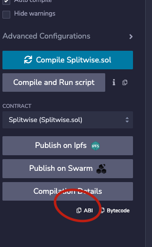
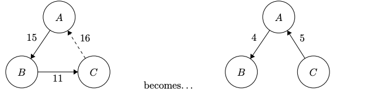

[](https://classroom.github.com/a/oulM_SuG)
## Ethereum Splitwise
In this assignment, you will be implementing a decentralized version of Splitwise. As you might know [Splitwise](https://www.splitwise.com/)
is a platform for keeping track of shared expenses between groups of people - we will be doing exactly that,
but balances will be tracked and managed on an Ethereum blockchain!\
You will have to implement smart contract for tracking user balances, as well as sort of a client library designed to
communicate with the blockchain and provide users an Enhanced interface of a contract.

To illustrate the application, consider the following scenario:\
Alice, Bob and Carol are all friends who like to go out to eat together. Bob paid for lunch last
time he and Alice went out to eat, so Alice owes Bob $10. Similarly, Carol paid when she and Bob
went out to eat, and so Bob owes Carol $10.
Now, imagine Carol runs short on cash, and borrows $10 from Alice. Notice that at this point,
instead of each person paying back their ‘loan’ at some point, they could just all agree that nobody
owes anyone. In other words, whenever there is a cycle of debt, we can just remove it from our
bookkeeping, making everything simpler and reducing the number of times cash needs to change
hands. In our smart contract we will be doing exactly that - removing cycles of debt, but more on that later.

### The Flow of an application
Every time Alice picks up a bill, she should submit a money request for the people she paid for. This request
will be a transaction to the smart contract, which updates its state and stores the **unaccepted** request for Bob.
Bob can then query the blockchain to view who requests money from him. Bob can now pay for the request instantly or
he can reject the request and not pay at all. 
Alice should have ability to query her sent requests as well as her received requests, if bob rejected or paid for the request, it should
be deleted from senders list, as well as from the receivers list.

#### How should it look

1. Alice Pays for Bob in a restaurant
2. Alice calls the `submitMoneyRequest` method, specifying bobs address and the amount she paid for him.
all amounts in this assignment are expressed in **Wei**.
3. Bob then can fetch his pending money requests to be able to pay for them.
4. Each MoneyRequest should have an unique identifier, to help users pay for specific requests. These Ids should be 
generated by the smart contract and should never overlap.
5. Then Bob Can Call `getReceivedRequests` method to see the received amounts, pick one of them and call `payForRequestedAmount` or
`payForRequestedAmount` methods to pay for it
6. after request is fulfilled, it should be deleted from the smart contract storage.

There are also a bunch of client API methods you should implement, defined in `src/Splitwise.ts` file, each of those methods
have corresponding description to help you understand the desired behaviour of the method.

### Getting Started
To implement the client library, First of all you need to install node.js version 18 or later, as well as npm.
I recommend using **nvm** (node version manager), a tool which lets you easily install and switch node.js versions.
You can view this article for instructions of [installing nvm.](https://asibin99.medium.com/how-to-use-node-version-manager-nvm-on-ubuntu-20-04-fa71c9929f51)

to make sure that correct version of node.js is installed through nvm type:
```shell
> node --version
v18.12.1
```
it should output version number higher or equal to 18.\
after making sure that node is installed, open the new terminal window, change directory to the project folder and
type:
```shell
npm install
```
it should install all the required dependencies for the project, like `typescript`, `ts-node` and `etheres.js`.\

The entry point for an application will be `src/index.ts` file, you can write your tests here, I will only be grading
`Splitwise.ts` file, and provide my own `index.ts`.\
To run an application, just type
```shell
ts-node src/index.ts
```
or _(if you failed to install ts-node)_
```
npx ts-node src/index.ts
```

this will run whatever code is written in `index.ts` file. You can run any typescript file with this command.

### Contract
You will be writing your smart contract implementation in `src/contracts/Splitwise.sol`.
Let's look at the starter code:
```solidity
// SPDX-License-Identifier: MIT
pragma solidity ^0.8.0;

contract Splitwise {

}
```
There are no restrictions in writing implementation of this contract, you can use any version of solidity, just change the
second line. I will be deploying the contract code on Sepolia network and connecting your client to it.\
Also note that any vulnerabilities in your contract will make you loose points.

### Client 
you should be initializing yous `Splitwise` class like this:
```typescript
async function main() {
    const splitwise = new Splitwise(
        '<contract address in Hex format>',
        '<your private key in Hex format>'
    );

    // this is how we call any of the functions defined in a class
    const addresses = await splitwise.getParticipatingAddresses();
}
```
Now suppose we have a view method in our contract called `getNodes`:
```solidity
    address[] nodes;

    function getNodes() public view returns (address[] memory){
        return nodes;
    }
```
We deployed the contract and now want to call this view function and get its results. We could go by several different
ways, I will showcasse two of them:
Approach #1:
```typescript
import {JsonRpcProvider, Wallet} from "ethers";
// first of all we need to define RPC provider class in our client code:
const provider = new JsonRpcProvider('https://rpc.notadegen.com/eth/sepolia');
const wallet = new Wallet('<your private key>', provider);
```
Note that `JsonRpcProvider` class takes RPC Url as constructor parameter, you can use the one defined in this example but
you also can get different rpc urls from different clusters from [here](https://chainlist.org/chain/11155111). just copy any of the links from
the list.

after we define the signer wallet object, we now need to define `Contract` abstraction object as well:
```typescript
const abi = [...];
const splitwise = new Contract('<contract address>', abi, wallet);
const result = await splitwise.getNodes() as string[];
```
Now let's break down what is happening here:
1. first of all we are creating new variable with the contract `ABI`, if you don't know what an ABI is, read 
[this article](https://www.alchemy.com/overviews/solidity-abi#:~:text=The%20Application%20Binary%20Interface%20(ABI)%20is%20an%20interpreter%20that%20facilitates,to%20interact%20with%20smart%20contracts.)
or just google `what is ABI` _(you could do this for any foreign concept or keyword btw)_.
You can get `ABI` of your contract from remix, where you compiled a solidity code:

Just Paste in code what you copied from the editor.
2. Ethers.js kindly provides us the wrapper class for interacting with smart contracts, we need to initialize the `Contract`
class by passing the address, `ABI` and the signer wallet we created earlier. with the contract object now we can call
any of the contract methods. for instance in above code snipped we are calling `getNodes` method, in this case it will returns
an array of addresses.

You should play with the library a bit to see how it interacts with different types of method and different data types.
You can also search for any functionality you want by googling someething like `ethers js how to do this`.

there is also an Approach #2 to call view methods for a contract:
```typescript
const iface = new Interface(['function getNodes() public view returns (address[] memory)']);
const result = await this.wallet.call({
    to: this.contractAddress,
    data: iface.encodeFunctionData('getNodes', [])
});
const a = iface.decodeFunctionResult('getNodes', result);
```
Several things to note here:
1. an `Interface` object should contain the list of function signatures we are going to use, as you might notice
the function signature in above example is copied directly from solidity code, 
2. as second parameter in `encodeFunctionData` method we can pass the arguments if the solidity function needs any.
3. As you might know solidity `calldata` location has it's own format and specification, it encodes all the variables
and function names in Hexadecimal format, and uses 256 bit chunks of memory to store each value, if values are small enough it
will be placed in one chunk, so the `Interface` class does those conversions for us. If you are interested more in calldata format
you could give [this page](https://docs.soliditylang.org/en/v0.8.21/abi-spec.html#abi:~:text=multiple%20of%2032.-,Function%20Selector%20and%20Argument%20Encoding,%EF%83%81,-All%20in%20all) a read.

#### Calling a State Changing function (or sending a transaction)
Now let's see how a state changing functions might be called. Consider this method in your solidity contract:
```solidity
address[] nodes;

function addNode(address node) public {
    nodes.push(node);
}
```

Here what client code will look like:
```typescript
const abi = [...];
const splitwise = new Contract('contract address', abi, wallet);
const result = await splitwise.addNode('0x65B65e70152324Bfa059dd1167AF346597958E72');
console.log(result)
```
the flow is probably the same as for the previous example, but the resulting value of a call is a bit different.
Here's what got printed out in the console:
```json
ContractTransactionResponse {
    provider: JsonRpcProvider {},
    blockNumber: null,
    blockHash: null,
    index: undefined,
    hash: '0x1943047bbc97e4935c9f7b11916cca26c9ec33a42c6e67787c93cf7b2618321a',
    type: 2,
    to: '0xFA364D20c8392906a00703e385Adc0EB31815Bc5',
    from: '0x1fE146AcB937F55C45D6228cAc315d2b91637e3e',
    nonce: 11,
    gasLimit: 49201n,
    gasPrice: undefined,
    maxPriorityFeePerGas: 1000000000n,
    maxFeePerGas: 1000000024n,
    data: '0x9d95f1cc00000000000000000000000065b65e70152324bfa059dd1167af346597958e72',
    value: 0n,
    chainId: 11155111n,
    signature: Signature { r: "0xbbb1ecf96b982f82095e2c32cf35d388597335a40bc11487a6960d40988c0598", s: "0x100f305eb2d76468a480d4fad8837cfd31455630099d813198dab8733b373a6c", yParity: 0, networkV: null },
    accessList: []
}

```
there are a bunch of information as you might notice, but only thing what is important for you is probably `hash` field
which contains transaction id, which you can use to view transaction status on etherscan.

If you want more flexibility to pass `value` ot `gasPrice` fields to the function, you could use the second approach:

```typescript
const iface = new Interface(['function addNode(address node) public']);
const result = await this.wallet.sendTransaction({
    to: this.contractAddress,
    // value: 1,
    gasPrice: 10000,
    gasLimit: 10000000,
    data: iface.encodeFunctionData('addNode', ['0xF9A9C8bB55cd9fb4D130429E1857595B32255c54'])
})
```
the `result` object is the same, but you could specify a bunch of transaction parameters like 'gas price', 'value' or 'gas limit',
I commented out `value` field, because the function is not payable and transaction would fail!

I think that would be it for client library overview, I think you could manage on your own from now.

### Client Methods

Let's overview methods you need to implement in `Splitwise.ts` file:\
There are two types of methods: commands - which are basically state changing functions on a blockchain,
the transaction should be generated and sent in these types of functions. ALl command functions should returns transaction
Id's sent to the blockchain.
Queries - this methods should not affect the state of a blockchain and should only return aggregated values through one
view calls or several ones depending on your implementation. Value returned should be in the same format as
specified in the method stubs in `Splitwise.ts` file.\
to get more detailed information on each function refer to comments in `Splitwise.ts` or ask me during the seminars.

## Reolving Loops of Debt

It's helpgul to think about money requests as the graph of dept, That is, say that each user is a node, and each
weighted directed edge from A to B with weight X represents the fact ‘A owes $X to B’. We will
write this as A (X =>) B.  We want our app to ‘resolve’ any cycles in this graph by subtracting the
minimum of all the weights in the cycle from every step in the cycle (thereby making at least one
step in the cycle have weight ‘0’).
example:


The requirement is that if potential cycles are formed when you are submitting a money request, than those cycles should be resolved
before the request is added to the blockchain. You can achive this by doing DFS in solidity, but that would take a lot of gas.
You can also control the loops on client side, by finding the loops before money request transactions are submitted, and sending specific payload to help
the contract find the loops.
for example, suppose we have `submitMoneyRequest` function in solidity, there are already two money requests subbmited:
1. Alice requests 15 wei from Bob
2. Bob requests 12 wei from John

Now if John wanted to submit a money request and ask Alice 10 wei, you could first fetch the state of a blockchain, 
determine that addition of this request would cause a cycle, then find a cycle path, for our example it will be: [ALice, Bob, John] and
submit this path together with a money request with transaction, in this case Contract would not have to run a full DFS of BFS scan to
find a loop and can just resolve the loop if `path` array is not empty.
Of course this is just an idea of implementation, you could go several ways there. You also can do the search on contract side,
despite the fact that it will be inefficient in gas costs, the solution will still be considered as valid.\
Remember, that you are free to design contract methods, that gives you much more freedom in coming up with different implementations.

Also Note: all of your methods on client side as well as contract side should account for invalid data as well, meaning they should revert or
throw exceptions if invalid parameters ar provided, for example address is not provided in hexadecimal format, amounts are passed as negatives
etc.

Another Note: you can limit the total users or total requests on some arbitrary value, contract doesn't need to be designed for real world use case,
so if some arbitrary limitation will help you with your implementations please do so!

Another Note: if some user just sends wei to the contract without calling or specifying any method, the amount should be
distributed to the requests this user have received earlier, if amount sent is greater than the total amount requested or
there are no requests sent to this specific user, the portion of the amount should be returned to the sender.

I think I covered everything concerning this assignment, will be updating this document if something new detail comes up.


